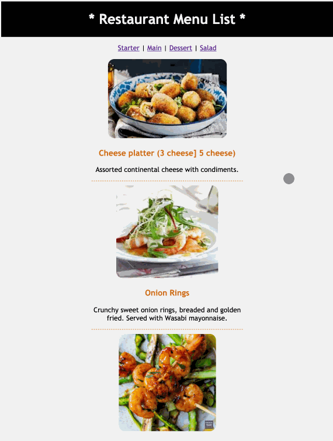

# menu-list-items []()
React Experiment - ( Project 02 )
Basic  Restaurant App to practice the React, React-Router and Axios.

### Chat Application -


### Dependencies -
ReactJS, React-Router and Axios

### Initialization -
After cloning the project to local path to run the application, follow the below steps.
```
To Run the applicatin -
git clone 'https://github.com/mnaresh2012/menu-list-items.git' - to copy the project to local
cd projectName - to change to the project folder
npm install - to install all dependencies
npm start - to start the server
```

### Changelog -
> 0.0.1: BETA version

### Licence []()
> The MIT License (MIT)
